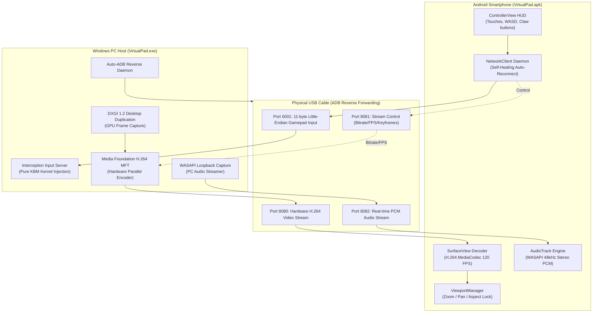

# VirtualPad — Ultra-Low Latency Virtual Gamepad & 120 FPS Desktop Mirror

[](https://github.com/ArjunSonara/keyboard-mouse-virtual-gamepad)
[-brightgreen.svg)](https://github.com/ArjunSonara/keyboard-mouse-virtual-gamepad)
[](https://github.com/ArjunSonara/keyboard-mouse-virtual-gamepad)
[](https://github.com/ArjunSonara/keyboard-mouse-virtual-gamepad)
[](https://github.com/ArjunSonara/keyboard-mouse-virtual-gamepad)

Turn your Android smartphone into an ultra-responsive, zero-conflict **virtual gamepad and high-refresh-rate gaming monitor** for PC games.

---

## 💡 The Problem with Traditional Virtual Gamepads

Most virtual gamepads (such as WoMic, Monect, PC Remote, VDX) emulate an **Xbox 360 / DualShock controller** via the ViGEmBus driver. In modern PC titles (*Red Dead Redemption 2*, *GTA V*, *Apex Legends*, *Cyberpunk 2077*, and mobile shooters played on PC emulators like *Free Fire* or *PUBG*), combining controller input with mouse look causes severe engine conflicts:
1. **Camera Stutter & Freezes**: Game engines lock out mouse aim whenever an analog stick is pushed.
2. **Violent UI Flickering**: HUD prompts flash uncontrollably between Controller buttons (`[A]`, `[RT]`) and Keyboard keys (`[E]`, `[LMB]`).
3. **High Latency & Separate Windows**: Players had to run one app for input and a completely separate app for screen streaming, adding lag and cable clutter.

---

## ⚡ The VirtualPad Solution

VirtualPad solves this by completely bypassing Xbox/controller emulation. Instead, it injects **genuine physical keyboard strokes and relative hardware mouse packets** directly into the Windows kernel using the **Interception driver**. The game sees only a single physical keyboard and mouse, eliminating all device conflicts.

Simultaneously, VirtualPad features an integrated **native C++ DirectX Desktop Duplication (DXGI 1.2) + Hardware H.264 (MFT) video and WASAPI audio mirror engine**. It streams your PC desktop directly onto your phone screen at up to **120 FPS** with bitrates up to **200 Mbps** and total host latency under **16 ms**.

---

## 🌟 Key Features

### 🎮 1. Zero-Conflict Keyboard & Mouse Simulation
- **Kernel-Level Interception**: Translates phone touch controls directly into raw physical keyboard key holds and relative mouse movements.
- **🏃 Joystick Sprint Lock & Dynamic Auto-Shift**: Push the analog stick forward past 80% to engage sprint (`Left Shift`) automatically, or slide up into the `🏃` notch for hands-free auto-run lock.
- **Multi-Source Key Arbitration (`_pulse_key`)**: Full support for mobile "claw" playstyles (e.g. holding Right Fire to swipe-aim while tapping Left Fire to place Gloo Walls or attack). Injects a calibrated 35ms micro-pulse so game engines register clean clicks without dropping inputs.
- **📜 Mouse Scroll Wheel Strip**: Fast weapon switching and sniper zoom with dedicated vertical touch strip and ratchet haptics.
- **⚡ 3-in-1 Macro Studio**: Record real finger rhythms on the live HUD, build combos with visual cards, or script human-readable combos (`TAP c 50ms, WAIT 30ms, TAP space 60ms`) with 1-click clipboard import/export.
- **Turbo Rapid Fire**: Turn any button into a rapid-fire trigger (5 to 30 clicks per second).
- **Rich Haptics**: Crisp micro-ticks, edge bumps, ratchet ticks, and heavy clicks across all buttons and stick boundaries.

### 📺 2. Ultra-Fast Desktop Video & Audio Mirror
- **Native C++ Streaming Core**: Powered by Windows Desktop Duplication API (DXGI 1.2) and Media Foundation Hardware H.264 Encoder (MFT).
- **Up to 120 FPS Fluidity**: Native 60, 90, and 120 FPS presets for silky-smooth motion.
- **High-Bitrate Presets (Up to 200 Mbps)**: Choose from 10, 20, 35, 50, 80, 100, 150, or **200 Mbps (Max Peak)** with a 300 Mbps dynamic encoder burst ceiling for lossless clarity.
- **Sub-Frame Host Latency**: Total capture + encode latency of only **10–16 ms**.
- **Real-Time WASAPI Audio Mirroring**: Dedicated Port 8082 stream capturing Windows system audio and playing it via low-latency Android AudioTrack with zero audio/video desync.

### 🎛️ 3. Dual On-Screen Control Architecture
- **⚙️ STREAM Control (Top-Left)**:
  - Select streaming resolution and frame rate (30, 60, 90, 120 FPS).
  - Adjust bitrate presets dynamically without disconnecting.
  - **Viewport Adjust Mode**: Pinch-to-zoom and pan/drag gestures to crop and fit the desktop stream to your phone screen's custom aspect ratio, with 🔒 **Screen Viewport Lock** for intense multi-touch gameplay.
- **⚙️ PAD Control (Top-Right)**:
  - Switch between 36 pre-configured game presets (*RDR2*, *GTA V*, *Free Fire*, *CS:GO*, *Racing*, *Retro*, etc.).
  - Customize HUD layout, resize and reposition buttons (0.5x to 2.2x), add up to 16 extra custom buttons, change shapes (Circle, Square, Pill), and adjust HUD opacity (100% solid to 20% ghost).

### 🔄 4. Self-Healing USB Input Daemon
- **Autonomous Auto-Reconnect**: Background daemon continuously monitors Port 6001. If the PC server is restarted, the USB cable is unplugged/replugged, or the phone app is sent to the background and resumed, the connection re-establishes silently and immediately.
- **Instant Keymap Sync**: Automatically pushes the active HUD key bindings to the PC server upon connection.

### 🚀 5. 1-Click All-in-One Desktop Launcher (`VirtualPad.exe`)
- Single standalone Windows executable. Requires zero command prompt or manual ADB commands.
- Automatically reverses all 4 required ports (`6001`, `8080`, `8081`, `8082`).
- Concurrently runs the Interception input server and the native desktop mirror engine.

---

## 🏛️ System Architecture



---

## 🎮 Default Key Mapping

| Phone Touch Control | PC Hardware Output | Default Game Action |
|---|---|---|
| **Left Joystick** | `W`, `A`, `S`, `D` | Movement (supports diagonal holds) |
| **Right Touch Area** | Relative Mouse Movement | Camera Aim / Look |
| **LB** | `Tab` | Weapon Wheel / Inventory |
| **RB** | `Q` | Take Cover / Ability |
| **LT** | `Mouse Right` *(Right Click)* | Aim Down Sights (ADS) |
| **RT** | `Mouse Left` *(Left Click)* | Shoot / Primary Attack |
| **Y** | `E` | Interact / Mount |
| **X** | `Space` | Jump |
| **B** | `R` | Reload / Melee |
| **A** | `LShift` | Sprint *(Tap or hold to run)* |
| **LSB** | `LCtrl` | Crouch |
| **RSB** | `C` | Look Behind / Eagle Eye |
| **D-Pad Up** | `H` | Whistle / Call Mount |
| **D-Pad Down** | `T` | Change Camera Perspective |
| **D-Pad Left** | `X` | Dual Wield / Quick Action |
| **D-Pad Right** | `X` | Dual Wield / Call |
| **Small Icon (Left)** | `Esc` | Pause / Game Menu |
| **Hamburger Icon (Right)** | `B` | Satchel / Map |

*(All keys and D-pad directions can be rebound inside the phone app via ⚙️ PAD → Customize HUD).*

---

## 🚀 Quick Start Guide

### 1. PC Setup (One-Time Driver Install)
1. Download the Interception driver installer from [Interception Releases](https://github.com/oblitum/Interception/releases).
2. Extract the archive, open Command Prompt **as Administrator** in the `command line installer` directory, and run:
   ```cmd
   install-interception.exe /install
   ```
3. **Restart your PC** (required for the kernel driver to load).

### 2. Launch the PC Server
- Double-click [**`VirtualPad.exe`**](VirtualPad.exe) in the root repository folder.
- It will automatically initialize the Interception driver, launch the native desktop mirror engine, and configure all ADB reverse ports.

### 3. Install the Android App
- Install the pre-built APK directly on your Android phone:
  - **APK File**: [`files/virtualpad_v2/VirtualPad.apk`](files/virtualpad_v2/VirtualPad.apk)
  - Or install via ADB:
    ```powershell
    adb install -r files/virtualpad_v2/VirtualPad.apk
    ```

### 4. Connect and Play
1. Connect your phone to your PC via a USB cable (ensure **USB Debugging** is enabled in Android Developer Options).
2. Launch `VirtualPad.exe` on PC.
3. Open **VirtualPad** on your phone. The app will automatically connect to `127.0.0.1:6001`, `8080`, `8081`, and `8082`.
4. Your PC desktop and audio will appear live on your phone with the virtual gamepad HUD overlaid on top.
5. Tap **⚙️ STREAM** (top-left) to adjust bitrate/FPS or lock the viewport; tap **⚙️ PAD** (top-right) to customize key bindings or choose game presets.

---

## 🔧 Building from Source

### Android App
```powershell
cd files/virtualpad_v2/android_app
.\gradlew.bat assembleDebug
```
Output APK: `app/build/outputs/apk/debug/app-debug.apk`

### PC Mirror Engine (C++ Native)
Requirements: Visual Studio 2022 with C++ Desktop Development (MSVC), Windows SDK.
```powershell
cd pc-mirror/mirror/windows-native
msbuild PCMirror.vcxproj /p:Configuration=Release /p:Platform=x64
```
Output Binary: `x64/Release/PCMirror.exe`

### All-in-One Desktop Launcher (PyInstaller)
```powershell
cd files/virtualpad_v2/pc_server
pip install -r requirements.txt
pyinstaller --onefile --distpath ".." launcher.py --name VirtualPad -y
```

---

## 📜 License

Distributed under the MIT License. See `LICENSE` for details.
